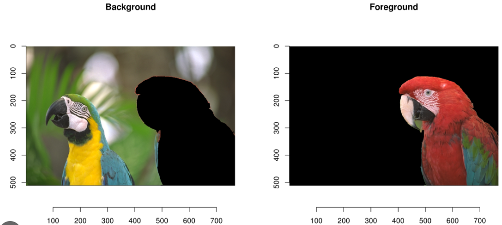
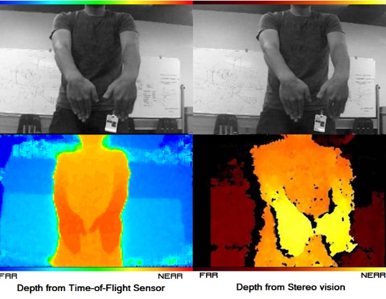
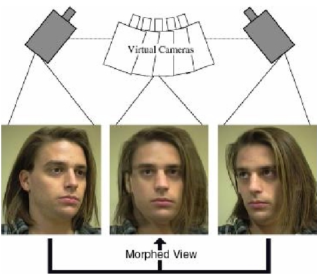
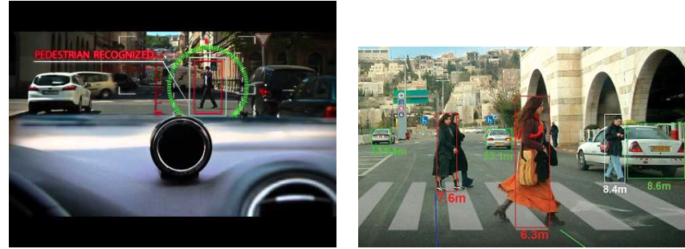

# Basic Problems Computer Vision

## What is Computer Vision

Computer vision is a field of artificial intelligence and computer science that enables computers to interpret and understand visual information from the real world, such as images or videos.

1. What is it? (Object detection / Recognition)
2. Where is it?
3. Where does it go?

**Object Detection vs Recognition**

While object detection locates objects within an image and provides bounding boxes around them, object recognition identifies objects without specifying their exact locations, focusing instead on classifying the objects present in the scene.

## Motion Analysis

> Foreground/Background Segmentation

- New images are compared to background model based on previous frames
- All pixels that do not correspond to background model are **labeled foreground**
- Can be challenging with dynamic environments such as moving trees...

> Optical Flow

- New image frame is compared to previous frame
- We look very locally, and determine to where the pixel is going
- Is not necessarly correct (i.e. the weels are in the wrong direction here)

> Odometry (ego-localization and tracking)

Essentially, you **estimate** the distance traveled from the camera images

This can be useful for: **tunnels**, **indoors in a factory**,

> Object Tracking based of FG/BG Segmentation

## 3D Modeling and Scene Reconstruction

> Stereo Vision

- **passive system** -> no light input
- **active system** -> active light input

This has an important function in the **military** :gun:

> Visual Hull

Geometric objects are created by **shape-from-silhouette** 3D reconstruction

> Image Stitching

Merging images together with overlapping fields to produce panoramic views
Common tools are: **ORB** or **SIFT**

> View Interpolation

> Pose Estimation

## Image Segmentation

You divide the image in different classes

### Grabcut Algorithm

## Object Detection

We can see that overlapping humans aren't necessarly detected, nor humans that are far away.

## Detection and Tracking

We can use **Grabcut** or **multiple cameras** to detect and track motions.

## Category Recognition

This allows us to detect things like: "human on bike", essentially combining two classes.

## Instance recognition

Is a computer vision task that involves identifying and delineating individual instances of objects within an image. Unlike traditional object recognition, which classifies entire objects within an image, instance recognition aims to differentiate between multiple instances of the same object class and provide a unique identifier for each instance.

