# Basic Problems Computer Vision

## What is Computer Vision

Computer vision is a field of artificial intelligence and computer science that enables computers to interpret and understand visual information from the real world, such as images or videos.

1. What is it? (Object detection / Recognition)
2. Where is it?
3. Where does it go?

**Object Detection vs Recognition**

While object detection locates objects within an image and provides bounding boxes around them, object recognition identifies objects without specifying their exact locations, focusing instead on classifying the objects present in the scene.

## Motion Analysis

> Foreground/Background Segmentation

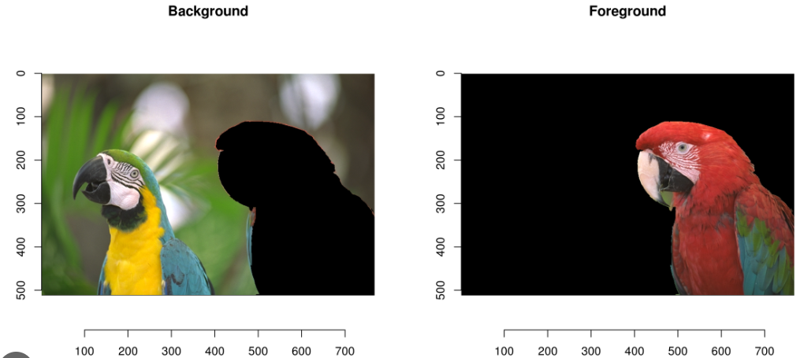

- New images are compared to background model based on previous frames
- All pixels that do not correspond to background model are **labeled foreground**
- Can be challenging with dynamic environments such as moving trees...

> Optical Flow

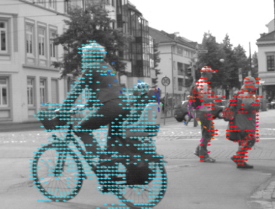

- New image frame is compared to previous frame
- We look very locally, and determine to where the pixel is going
- Is not necessarly correct (i.e. the weels are in the wrong direction here)

> Odometry (ego-localization and tracking)

Essentially, you **estimate** the distance traveled from the camera images

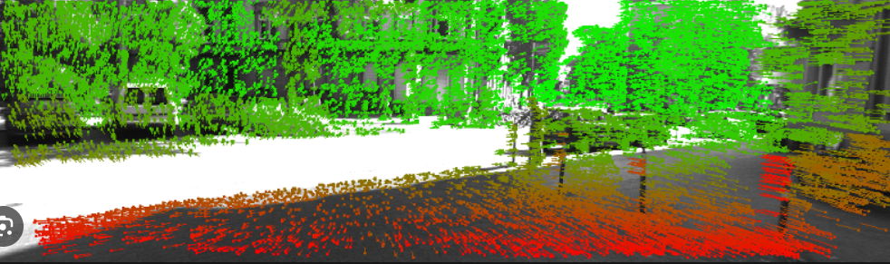

This can be useful for: **tunnels**, **indoors in a factory**,

> Object Tracking based of FG/BG Segmentation

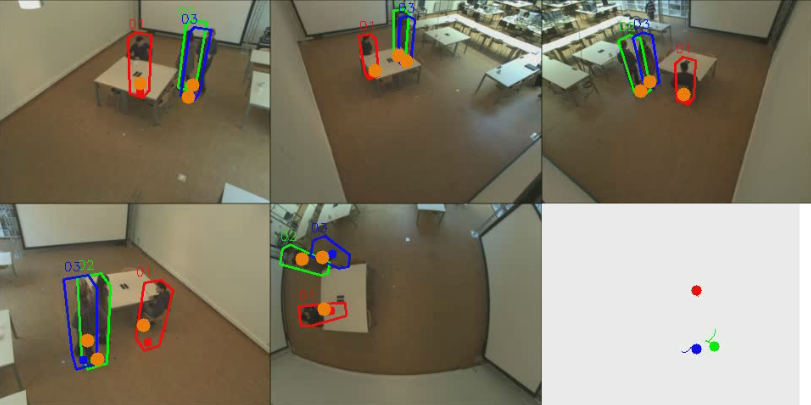

## 3D Modeling and Scene Reconstruction

> Stereo Vision

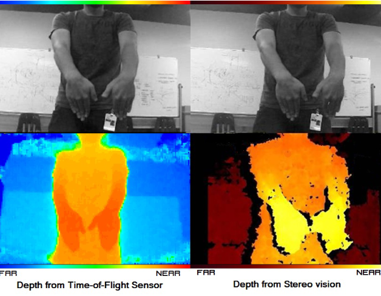

- **passive system** -> no light input
- **active system** -> active light input

This has an important function in the **military** :gun:

> Visual Hull

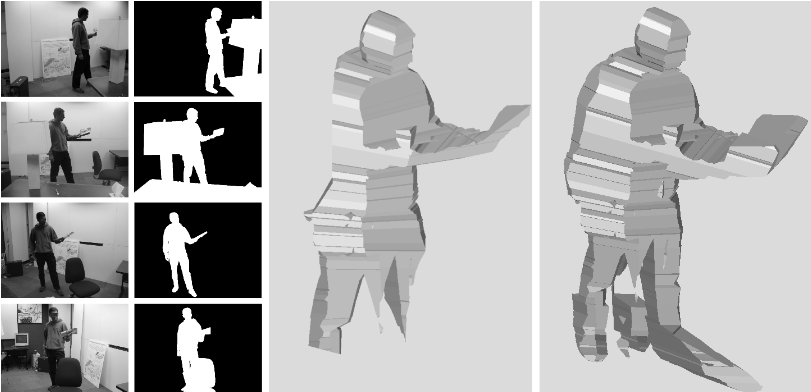

Geometric objects are created by **shape-from-silhouette** 3D reconstruction

> Image Stitching

Merging images together with overlapping fields to produce panoramic views
Common tools are: **ORB** or **SIFT**

> View Interpolation

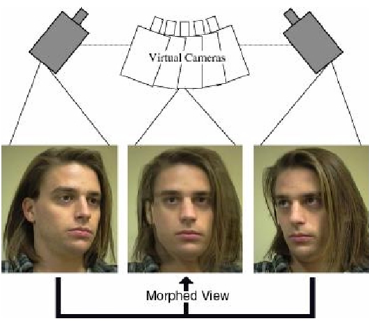

> Pose Estimation

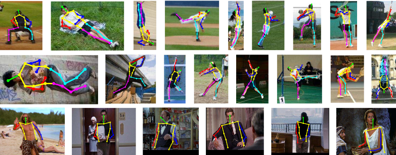

## Image Segmentation

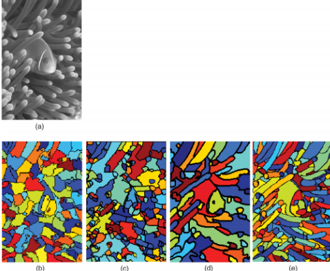

You divide the image in different classes

### Grabcut Algorithm

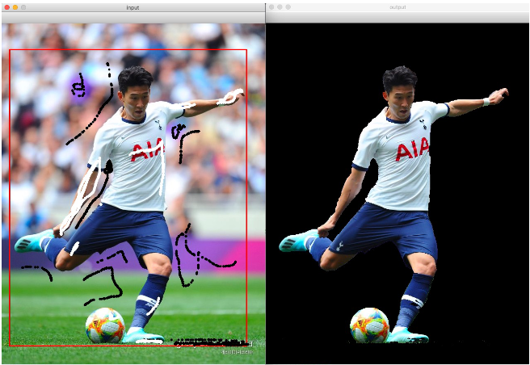

## Object Detection

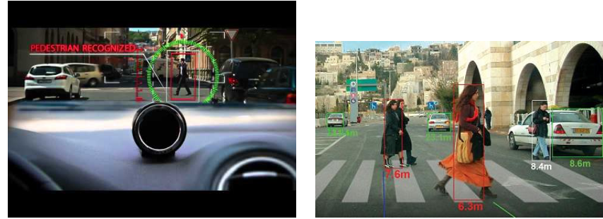

We can see that overlapping humans aren't necessarly detected, nor humans that are far away.

## Detection and Tracking

We can use **Grabcut** or **multiple cameras** to detect and track motions.

## Category Recognition

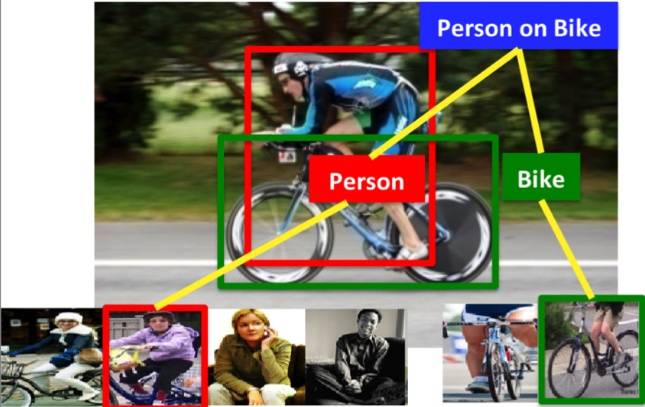

This allows us to detect things like: "human on bike", essentially combining two classes.

## Instance recognition

Is a computer vision task that involves identifying and delineating individual instances of objects within an image. Unlike traditional object recognition, which classifies entire objects within an image, instance recognition aims to differentiate between multiple instances of the same object class and provide a unique identifier for each instance.

# Homogeneous Coordinates

We need something to represent coordinates in infinity. This is particularly useful for dealing with projective geometry, where parallel lines meet at a vanishing point.

- Homogeneous coordinates are better suited describing projections compared to cartesian coordinates.
- Better representations, simplifies math
- **Affine transformation**: We can represent affine transformations (translation, rotations, scaling, ...) as linear transformations.
- **real projective plane** (= the set of all lines through the origin in a three-dimensional euclidean space where two lines are considered equivalent if they are parallel) = Euclidian space + points at infinity

### Projective plane

2D point -> (X, Y, Z); // X, Y, Z are **non-zero**
:arrow_right_hook: (X, Y, Z) = (X$\lambda$, Y$\lambda$, Z$\lambda$)
:arrow_right_hook: if Z != 0 -> (X/Z, Y/Z) in euclidian space -> **point in infinity**
:arrow_right_hook: points (X, Y, 0) lie in infinite space

- Here, lines in XY plane correspond to points at infinity
- All (X, Y, Z) != (0,0,0) on the line passing through (a, b, 1) represent the same projective point

**equation of line**: $ax + by + cz = 0$ -> homogeneous (order is the same)

with:
a, b, c constants
(a, b, c) = $lambda$(a, b, c) if $lambda$ != 0
line passes through the point (b, -a, 0) at infinity
each **line (non-inf)** meets the **line at infinity** in **exactly one point**

### Lines in the projective plane

When (X, Y, Z) in the **projective plane** lies on a line with coefficients (a, b, c) :arrow_right: (X/Z, Y/Z) in the euclidean plane lies on a line defined by the same coefficients (a, b, c)

Look at the following situation:

Parallel Lines in the Euclidean plane::
$ax + by + c1 = 0$, $ax + by + c2 = 0$,

These meet in (b, -a, 0) in infinity

=> **parallelism** is replaced by **concurrency** at infinity

- Each line in the affine plane $w$ = 1 corresponds to a plane in xyw-space

- Two lines in the affine plane meet at infinity in point $ax + by = 0$ with $w=0$

### Calculations with lines and points

Now, the point (X, Y, Z) can be defined as:

- A line can be defind by two points x and y:
  $I = X \times Y$

=> Proof

let the line be constructed as follows:

-> we can then proof that points x and y are lying on this line:

\*\*analogously, a point can be defined as the intersection of two lines l and m: $x = l \times m$

this **l** is a homogeneous 3-vector, it is **perpendicular** to every point **p** on the line:
$I^T p = 0$

### Point and line duality

**Duality Principle:**

The duality principle in computer vision states that geometric properties of points in an image are equivalent to properties of lines (or planes) in a dual space.

### Geometric interpretation of line intersection

- Line parameters are defined by two points:
  

- Point parameters by intersection of two lines:
  

Now suppose **l** and **m** are two parallel lines (we now know that they come together in (b, -a, 0))

### Projective Space

Similar to the previous space:

### Hierarchy of 2D transformations

### Similarity transformation

Remember, because of these homogenous coordinates, we can easily rotate, scale, ... our images

Here is an example of rotation:

4 parameters

### Affine transformation

another example, this time **skew**:

6 parameters

### 2D Homography

A 2D homography, often referred to simply as a "homography," is a transformation that maps points from one 2D plane to another 2D plane. It is a type of projective transformation that preserves straight lines but not necessarily angles or distances.

For the rest of the document, I will be using the notes made in class, this is to create time for other things...

[Continuation Chapter 2a](./ch02a_image_formation_pdf.pdf)

# Image Formation: Camera Calibration

[pdf](./ch02b_camera_calibration_pdf.pdf)
