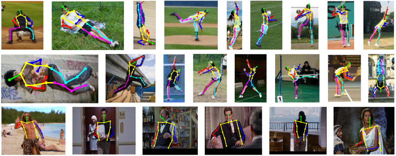

# Computer vision 2023-2024

## Basics

### What is computer Vision?

Computer vision tries to understand RGB images, videos, point clouds, depth images etc.

It tries to find an answer on these questions:
- What is it? Can be done with Object detection/recognition
- Where is it? Can be done with 3D scene reconstruction
- Where does it go? Can be done with motion analysis

### Motion analysis

Motion analysis is trying to decide where the object is going.

#### Foreground/Background segmentation:

Here you **separate** the foreground from the background. A new image frame is compared to the background model based on previous frames. All pixels that do not correspond to the background model are labeled as foreground. You can do this using **background subtraction**, deep learning-based methods or a mixture of Gaussian models can be employed for this purpose. 

**Challenging problems:**
- Image noise
- Illumination changes
- moving foreground (leaves), shadows, rain, snow, fog, headlights etc

#### Optical Flow Analysis: 

  

This refers to the **pattern of apparent motion of objects**, surfaces, and edges in visual scene caused by the relative motion between an observer and the scene. Optical flow analysis **estimates the motion of objects by tracking the displacement of pixels** between consecutive frames in a video sequence. Flow vectors are then computed. This information is useful for understanding the dynamics of a scene, detecting moving objects, or estimating the camera's motion.

**Challenging problems:**
- Image noise
- Illumination changes
- ...

#### Odometry for Ego-Localization and Tracking:

Odometry is the use of data from **motion sensors** to estimate the position, orientation and distance of a moving vehicle (or robot) over time. In the context of ego-localization, odometry helps **determine the position and movement of the observer** (camera, robot, etc.) relative to its surroundings. This information is crucial for tasks like **navigation, mapping, and autonomous vehicle control.**

#### Object Tracking based on FG/BG Segmentation:

  

Once foreground objects are detected through segmentation, **object tracking algorithms** can be applied to follow these objects across frames. These algorithms often involve associating detected objects in the current frame with previously tracked objects, using techniques like **Kalman filters**, **particle filters**, or **deep learning-based trackers**. By continuously updating the position and characteristics of tracked objects, this process enables tasks such as **surveillance, activity recognition, and behavior analysis**.

### 3D modeling and scene reconstruction

#### Stereo Reconstruction

  

Stereo reconstruction leverages the **information from two or more images** taken from **different viewpoints** to reconstruct the **3D structure of a scene**. By analyzing the disparities between corresponding points in these images, it's possible to compute **depth information and create a depth map**. Techniques such as stereo matching algorithms (e.g., block matching, semi-global matching) are often used to find corresponding points and compute disparities.

#### Visual Hulls

  

Visual hulls represent the **shape of an object or scene** by **intersecting the viewing frustums of multiple cameras or viewpoints**. This technique is based on the **principle that the volume occupied by an object can be inferred by determining the regions that are visible from different viewpoints**. Visual hulls are often used for object reconstruction and shape estimation.

#### Image Stitching

Image stitching is the process of **combining multiple overlapping images** to create a panoramic or wide-angle view of a scene. This technique involves **finding corresponding points between images**, estimating the transformation (e.g., homography) between them, and blending the images seamlessly. Image stitching is commonly used in applications such as panoramic photography, **virtual tours**, and mapping. Common tools are SIFT or ORB feature detectors in combination with descriptors. The Ransac algorithm or affine/homographic transformations.

#### View Interpolation

  

View interpolation involves **synthesizing new views of a scene from existing views or images**. This technique is useful for **generating intermediate views** between known viewpoints or for virtual camera navigation in 3D environments. View interpolation can be achieved through methods like **depth-based rendering, image-based rendering, or morphing**.

#### Pose Estimation

Pose estimation refers to the process of **determining the position and orientation (pose) of a camera relative to a scene or object.** This information is essential for aligning images in 3D reconstruction, tracking camera motion, or registering virtual objects into real-world scenes. Pose estimation techniques can be based on **feature matching, geometric constraints, or deep learning approaches**.

### Object and scene segmentation/detection/recognition

  

**Image segmentation** is segmenting an image into **subparts** based on common characteristics like **texture, color, smoothness, etc**.

For the rest he shows a lot of pictures of hand tracking, object detection. 

## Image formation: Projective geometry

### Homogeneous coordinates

  

When projecting a 3D scene onto a 2D plane, what happens with parallel lines? They don't seem that parallel anymore don't they... This is because of the projection. This introduces a new concept, **points at infinity**. 

The **real projective plane** is an **extension of the Euclidean plane**. It includes all the usual points of the Euclidean plane plus additional "points at infinity". These points at infinity are used **to treat parallel lines** as if they intersect **at a unique point at infinity**, thus unifying the treatment of parallel and intersecting lines.

3D scenes are often projected onto 2D planes (like a computer screen) for visualization. **Homogeneous coordinates** facilitate this process. A 3D point (X, Y, Z) in space can be projected onto a 2D surface. This involves a **mathematical transformation** (like a perspective projection), where **distant objects appear smaller than closer ones**, **mimicking** how the human eye perceives **depth**.

In projective geometry, **parallelism and concurrency** are indeed instances of the same concept. **Parallel lines** in Euclidean geometry meet at a **point at infinity** in projective geometry. Similarly, **concurrent lines (lines that all intersect at a single point)** in Euclidean geometry are just a special case where the point of intersection is not at infinity.

**Homogeneous coordinates** are particularly suited for describing projections for several reasons:

- **Ease of Mathematical Operations:** They simplify many geometric transformations, such as translation, rotation, and scaling, into matrix operations.
- **Handling Points at Infinity:** They provide a natural way to deal with points at infinity, crucial for understanding projections and perspective.
- **Unified Framework:** They offer a unified framework for dealing with both finite and infinite points, making algorithms more elegant and general.

**Some rules of the projective plane:**

  

2D point is represented by triple (X, Y, Z), where X, Y, Z are not all zero. ($\lambda$X,$\lambda$Y,$\lambda$Z) represent the same point for all $\lambda \neq 0$. When Z $\neq 0$ (X, Y, Z) in the projective plane corresponds to $(\frac{X}{Z}, \frac{Y}{Z})$ in the Euclidean plane. The points (X, Y, 0) are points at infinity in the projective plane, and they lie at the line at infinity.
